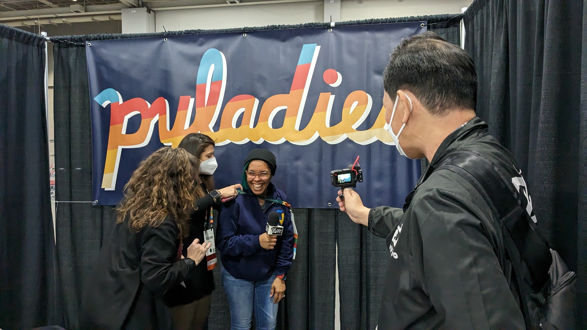

# コラム　「動画インタビュー」

このコラムは寺田 学(@terapyon)がお届けします。

イベント中に撮影し YouTube に公開した「PyCon US 2023 レポート動画」について紹介します。

現地の雰囲気を知ってもらおうと思い、スポンサーブースなどが設置されているホールを中心に動画を撮影してきました。
公開した動画は、Day 1 / 2 のブースでのインタビューと、Day 3 のポスターセッションとジョブフェアを紹介した、2 本（それぞれ、YY 分、ZZ 分）です。
インタビューはイベントの Chiar（代表者）や APAC 地域のカンファレンスオーガナイザーといったコミュニティ関連の方々とブースを担当していた企業の方々にお話を聞きました。みなさん快くインタビューに答えていただけました。
URL:

この動画は毎月 Live 放送している[PyCon JP TV](https://tv.pycon.jp)の活動の一環として取りまとめました。
また、[2023 年 5 月 12 日の Live 放送](TBD)で、撮影時のエピソードも交えながらお届けしました。ご覧になっていただくと PyCon US の雰囲気がより分かるかと思います。
