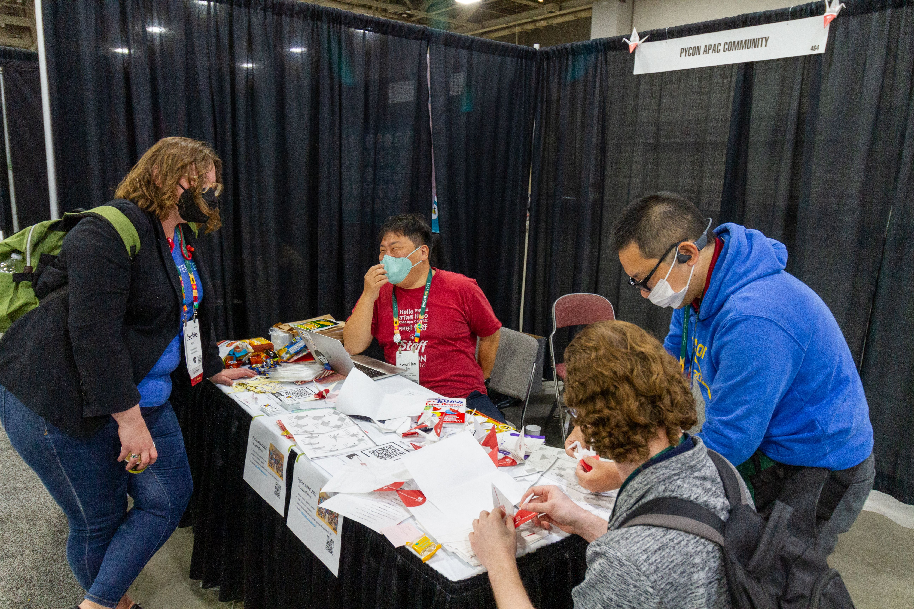

# Day 1

さてカンファレンス1日目です。
カンファレンス期間中は毎日朝食が出ます。助かりますね。
また、食事は全てベジタリアン用のメニューも用意されています。

```{figure} images/breakfast.jpg
:width: 600

1日目の朝食はブリトー
```

## オープニング

カンファレンスのオープニングはConference ChairであるMariatta([@mariatta](https://twitter.com/mariatta))氏からのあいさつです。
冒頭にPyCon USの20年の歴史を振り返る動画が紹介されました。
今年2023年はPyCon USが2003年に初開催されてから20回目となります（2020年は中止）。

```{figure} images/opening.jpg
:width: 600

Mariatta氏によるオープニング
```

最初に参加者、スタッフ、ボランティア、スポンサーなどへの感謝が述べられました。参加者はこの時点で2,000名ほどだそうです。
その後自らのストーリーが語られました。
Mariattaさん自身は2015年にPSFによる参加費のサポートによってPyCon USに参加し、そこで自分の人生が変わったそうです。
そこでは女性が沢山発表しており、自分もそうなりたいと思い、その後自分も発表できるようになったり、Pythonのコアデベロッパーとなっていったそうです。

そしてPyCon US 2023のイベントの紹介がおこなれました。
キーノートスピーカー、スペシャルゲスト、89のトークは全て生中継すること、PyLadies Auction、Open Spacesなどなど。
またモバイルアプリの紹介もありました。このアプリはタイムテーブルの確認にとても便利でした。

なお、PyCon US 2023ではマスクの着用は必須です（アメリカの市内はマスクをしている人はあまりいません）。
注意を受けたら名札をスキャンして1ストライク、3回スキャンされたらアウトとなって退場になるそうです。

## Keynote: Ned Batchelder

オープニングのあとは、Ned Batchelder（[@nedbat](https://twitter.com/nedbat)）氏によるキーノートです。
Ned氏が初めて参加したPyCon USは2007年で、そのときのPythonの作者であるGuido氏のトークはPython 3.0についてのものでした（Python 3.0は2008年12月にリリースされています）。

```{figure} images/ned.jpg
:width: 600

Ned Batchelder氏
```

このトークは「人」についての話をします。
人は不確かで複雑です。
人には標準も存在しないし、ドキュメントもないし、予測もできません。
状態が隠れているし、エラーメッセージが明確じゃありません。

そんな人に対してのAPIユーザーガイドを、自身の経験に基づいて紹介していきます。
人のメッセージには情報と感情が存在します。

* Information + Sentiment
* Defaulted sentiment
* 対策
  * Noって言わない?
  * 言葉が足りない
  
  
## Inside CPython 3.11's new specializing, adaptive interpreter.

* Brandt Bucher
* スライドの日付が間違っているのを指摘されて、その場で直すハプニング
* 6年前からPythonを使い始めた。今はMSのCPython Fasterチーム
* バイトコードがどう変わったか
  * `dis.sid()` で adaptive=Trueを付けると培地コードが変わる
  * `LOAD_ATTR_INSTANCE_VALUE` 前に読んだときと乾いてなければ速く動く
  * `BINARY_OP_ADD_FLOAT`
* `show_cashes=True` でキャッシュの状況が見れる
* `specialist --blue`
  * https://github.com/brandtbucher/specialist

```python
y = dy + self.py
cls = type(self)
```

* CPython 3.12でバイトコードが変わる
  * 3.12でスペしアライズされたバイトコードが増えた
  * キャッシュが減る
* [PEP 659 – Specializing Adaptive Interpreter | peps.python.org](https://peps.python.org/pep-0659/)

## Build Yourself a PyScript

* Nicholas H.Tollervey, Paul Everitt
* お互いを自己紹介
* pyscriptの基本的な書き方を説明
* pyscript.jsを見せながら、どうなっているかを説明
* MicroPythonでPyScriptを動かす?
* なんか字幕との掛け合いが始まる。おもしろい
* emscripten
 * https://pypercard.readthedocs.io/en/latest/

```{admonition} PyCon APACブース
このコラムは吉田([@koedoyoshida](https://twitter.com/koedoyoshida))がお届けします。

今回はPyCon APACブースをPyCon USで初出展しました。
PyCon APAC自体は2010年からAPAC地域で持ち回りで開催している
国際的なPyConイベントとなりますが、イベント自体は各国のPyConのオーガナイザーが
開催しているため、いままではあまり共同ではアピールはしてきませんでした。
今回ブース出展することも有り、共通ロゴやAPAC共通のWebサイト[PyCon APAC Organizers](https://pycon.asia/)を作成しました。

また、APACをアピールできる配布物や出展物を各自持ち寄りました。
PyCon JPからは日本らしく紅白の折り紙でAPACで開催される主要なPyConの紹介とwebサイトを紹介する折り紙など準備し持ち込みました。

この折り紙は鶴型に折ることが出来るようになっていて、APACの出展メンバーや
ブース訪問の参加者の方にAPACの紹介を兼ねてそのまま渡したり、英語での折り方ガイド
をみせつつ、一緒に鶴を折ってそれを持ち帰ってもらったり出来、非常に好評でした。

また、PyCon US開催に合わせて[PyCon APAC 2023 CFP(Call for proposal)サイト](https://pretalx.com/pyconapac2023/cfp)をオープン出来ましたので、そのアピール用の資料等も現地で作成、印刷し配布できました。
APAC地域やそれ以外の国の方含めブースに良く訪問があり、PyCon USに出展してアピールできた事は
とても良かったと思います。



```

## オープンスペース

会期中は小さな会議室でオープンスペースというものが開催されています。
オープンスペースというのは、場所と時間枠が用意してあるので、そこで議論したいことなどがある人が議論したい内容など枠を確保するものです。
[アンカンファレンス](https://ja.wikipedia.org/wiki/%E3%82%A2%E3%83%B3%E3%82%AB%E3%83%B3%E3%83%95%E3%82%A1%E3%83%AC%E3%83%B3%E3%82%B9)とも呼ばれます。

PyCon US 2023ではカンファレンスの3日間毎日、1時間ごとにオープンスペースの枠が用意されていました。
ボードを見てみると技術系だけじゃなく、カンファレンス主催者のミートアップ、高校の先生、自転車・カヤック、広東語をしゃべる人などさまざまです。

```{figure} images/openspaces.jpg
:width: 600

オープンスペースのボード
```

筆者はそのうちの1つ、[Python Bytes](https://pythonbytes.fm/)というポッドキャストの公開収録に参加してみました。
このポッドキャストは過去にも聞いたことがありますが、Pythonに関するさまざまな話題を扱っています。

```{figure} images/pythonbytes.jpg
:width: 600

ホストのMichael氏とBrian氏
```

このときに収録されたポッドキャストはすでに公開されています。
冒頭に参加者の拍手があるのが、公開収録っぽい感じで面白いです。

* [Episode #333 Live From PyCon - \[Python Bytes Podcast\]](https://pythonbytes.fm/episodes/show/333/live-from-pycon)

## ライトニングトーク

カンファンレンス1日目の最後はライトニングトークです。
出力がカラフルになった[tox](https://tox.wiki/en/latest/) 4の紹介、ソースコードを読みやすくサービス[Sourcery](https://sourcery.ai/)の紹介、Zen of Pythonについてのトークなどがありました。

スピーカーの一人に謎のマスクマンがいました。
実は彼はフィリピンから参加していたSony Valdez（[@MrValdez](https://twitter.com/MrValdez)）氏で、自身の経験としてのゲーム開発について語り、最後にAPAC地域のPyConについて紹介していました。
これより前にSony氏とはあいさつしてたんですが、マスクをかぶっていたので同じ人だと全然思っていませんでした。


```{figure} images/lt1.jpg
:width: 600

謎のマスクマンによるライトニングトーク
```

## APACメンバーでの夕食とPyParty

PyCon US 2023には日本だけで無く、多数のAPAC地域から参加しているメンバーがいました。
そこで、この日はカンファレンス終了後にみんなで集まって食事をすることにしました。
日本、韓国、台湾、香港、フィリピン、タイ、中国から合わせて20名ほどが参加し、交流を深めました。

```{figure} images/apac-members.jpg
:width: 400

APAC関連の面々
```

ここでの食事はフードコートのためお酒がありません、そこで企業（AWSとSuperblocks）が主催するパーティーに参加してきました。
場所は初日にも訪れたSquatters Pub Breweryです。
このパブは3階建てなんですが、全てを貸し切りでドリンクとフードも全部企業持ちです。太っ腹！！
スポンサー企業に感謝しつつおいしいビールをいただいて、カンファレンス1日目は終わりました。

```{figure} images/pyparty.jpg
:width: 600

PyPartyの様子
```
